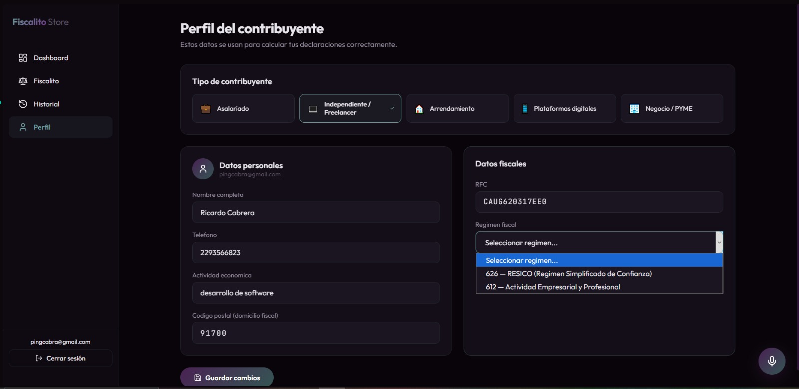
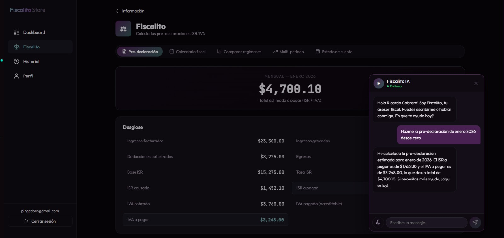

<div align="center">


# Fiscalito MVP

**Marketplace de servicios fiscales inteligentes para contribuyentes mexicanos**

Un asistente fiscal agéntico que entiende voz, opera la aplicación por su cuenta y calcula tus pre-declaraciones ISR/IVA con un motor determinístico auditable.


</div>

---

## Tabla de contenidos

- [¿Qué es Fiscalito?](#qué-es-fiscalito)
- [Arquitectura agéntica](#arquitectura-agéntica)
- [Stack tecnológico](#stack-tecnológico)
- [Estructura del monorepo](#estructura-del-monorepo)
- [Cómo correrlo localmente](#cómo-correrlo-localmente)
- [Features destacadas](#features-destacadas)
- [Roadmap](#roadmap)
- [Autor](#autor)

---

## ¿Qué es Fiscalito?

Fiscalito Store es un **marketplace web de servicios inteligentes para personas físicas y PYMEs mexicanas**. Cada servicio del marketplace resuelve una obligación legal o financiera concreta: fiscal, laboral o contable.

El primer servicio publicado es **Fiscalito**, un asistente fiscal que:

- Calcula **pre-declaraciones de ISR e IVA** con un motor determinístico (tablas oficiales SAT 2026, Art. 96, Art. 106, Art. 152 LISR, Art. 5 LIVA).
- **Parsea CFDIs v3.3 y v4.0** sin dependencias externas, distinguiendo PUE / PPD y complementos de pago.
- **Explica cada cálculo en lenguaje natural** con un LLM, citando el régimen y los artículos aplicables.
- **Habla y escucha**: chat de voz con Whisper STT → GPT-4o-mini → TTS, integrado como botón flotante en toda la app.
- **Opera la aplicación por sí mismo** mediante un loop de *tool calling* real (no regex, no tags). El usuario dice qué quiere y el agente navega, carga facturas, calcula y exporta.

> **No es** un chatbot genérico ni un curso de finanzas.
> **Es** una tienda de microservicios donde cada uno calcula como contador y explica como maestro.

<div align="center">
  
  <br/>
  <em>Onboarding del contribuyente — detecta el tipo (Asalariado, Independiente, Arrendamiento, Plataformas, PYME) y desbloquea solo los tabs y obligaciones aplicables al régimen seleccionado.</em>
</div>

---

## Arquitectura agéntica

Fiscalito está construido alrededor de **dos agentes con tool calling real** y, próximamente, un **flujo de automatización n8n** que cierra el ciclo end-to-end.

```
                    ┌────────────────────────────────────────────┐
                    │              FRONTEND (React 19)           │
                    │                                            │
   Usuario  ──voz──►│  Voice Loop                                │
   o texto          │  ├─ Whisper STT (OpenAI)                   │
                    │  ├─ Agent Loop ◄──── tool calling ────┐    │
                    │  └─ TTS-1 voz "nova"                  │    │
                    │                                       ▼    │
                    │                              ┌──────────────┐│
                    │                              │ Herramientas ││
                    │                              │ del frontend ││
                    │                              ├──────────────┤│
                    │                              │ navegar      ││
                    │                              │ cargar_xmls  ││
                    │                              │ calcular     ││──┐
                    │                              │ explicar     ││  │
                    │                              │ exportar_pdf ││  │
                    │                              └──────────────┘│  │
                    └────────────────────────────────────────────┘  │
                                       │                            │
                                       │ Firebase Auth + Firestore  │
                                       │ (perfil, historial)        │
                                       │                            │
                                       ▼                            │
                    ┌────────────────────────────────────────────┐  │
                    │       BACKEND  —  Fiscal Agent API         │◄─┘
                    │       (FastAPI · Python · stateless)       │
                    │                                            │
                    │  ┌──────────────────────────────────────┐  │
                    │  │  Motor fiscal determinístico         │  │
                    │  │  Tablas ISR 2026 (RESICO, Art. 96)   │  │
                    │  │  IVA flujo de efectivo (Art. 5 LIVA) │  │
                    │  │  PUE / PPD + complementos de pago    │  │
                    │  └──────────────────────────────────────┘  │
                    │                                            │
                    │  ┌──────────────────────────────────────┐  │
                    │  │  Agente backend (tool use)           │  │
                    │  │  leer_perfil · obtener_predec ·      │  │
                    │  │  crear_predeclaracion                │  │
                    │  └──────────────────────────────────────┘  │
                    │                                            │
                    │  LLM dual: OpenAI o Anthropic (config env) │
                    └────────────────────────────────────────────┘
                                       ▲
                                       │ POST /api/v1/pre-declaracion
                                       │
                    ┌──────────────────┴─────────────────────────┐
                    │   Flujo n8n  (en desarrollo — Sprint 2)    │
                    │                                            │
                    │   Gmail (factura adjunta) ──► AI Agent ──► │
                    │   Fiscal Agent API ──► Firestore ──►       │
                    │   Email: "tu pre-declaración está lista"   │
                    └────────────────────────────────────────────┘
```

### Agente del frontend — `agentLoop.ts`

Loop de tool calling con **OpenAI GPT-4o-mini** y `tool_choice: "auto"`. Hasta 8 iteraciones por turno, herramientas tipadas, ejecución en el cliente y resultados re-inyectados al LLM hasta que emite respuesta de texto final. Cada `tool_call` se registra en un *Agent Context* observable para tener trazabilidad de qué hizo el agente y por qué.

Herramientas registradas hoy:

| Tool | Descripción |
|------|-------------|
| `navegar` | Cambia de ruta con React Router. Reemplaza al viejo regex `[NAVEGAR:]`. |
| `cargar_xmls_demo` | Lee CFDIs de `/public/demo-xmls/{año}/{mes}/` y los parsea con `cfdiParser`. |
| `calcular_predeclaracion` | Llama al Fiscal Agent API con perfil + CFDIs y guarda el resultado en Firestore. |

<div align="center">
  
  <br/>
  <em>El usuario pide "Hazme la pre-declaración de enero 2026 desde cero" y el agente, en un solo turno, navega al tab correcto, carga los CFDIs, llama al motor fiscal, guarda el resultado en Firestore y lo comenta en lenguaje natural.</em>
</div>

### Agente del backend — `app/routes/agente.py`

`POST /api/v1/agente/predeclaracion`. Tool use con soporte dual **Anthropic Claude** / **OpenAI GPT**, seleccionable por variable de entorno. Tres herramientas: leer perfil del contribuyente, consultar historial de declaraciones, crear una nueva pre-declaración llamando al motor determinístico. El backend es completamente *stateless*: todo el contexto viaja en el request.

### Por qué separar motor y LLM

Los cálculos fiscales son **deterministas y auditables**: usan tablas ISR codificadas y validadas contra el caso real `CADG620317EE0` de enero 2026 (33 facturas PUE consolidadas, una PPD con complemento, una PPD sin complemento, ISR causado exacto a dos decimales). El LLM **solo explica** el resultado, nunca lo calcula. Esto evita alucinaciones en montos y mantiene el sistema defendible frente a un contador.

---

## Stack tecnológico

### Frontend (`apps/store`)

- **React 19** + **Vite 6** + **TypeScript 5.6** estricto
- **Firebase** — Auth (email + Google) y Firestore para perfiles e historial
- **OpenAI directo desde cliente** — Whisper, GPT-4o-mini con tool calling, TTS-1 voz "nova"
- **React Router v7**, `lucide-react` para iconos
- **jsPDF + autoTable** para exportar declaraciones a PDF
- **CSS custom con variables** — sin Tailwind, sin Material UI, dark theme con paleta púrpura/teal
- Tipografías: **Outfit** (UI) y **JetBrains Mono** (datos)

### Backend (`apps/api` — Fiscal Agent API)

- **FastAPI** + **Pydantic v2**
- **LLM dual**: OpenAI o Anthropic, configurable vía `.env`
- **pytest** — 93 tests pasando, incluyendo casos reales con CFDIs auténticos
- **Deploy target**: Google Cloud Run (containerized, serverless)
- **Logs estructurados** en JSON listos para Cloud Run

### Automatización (en desarrollo)

- **n8n** self-hosted (Docker local en dev, Railway/Render para producción)
- **Gmail API** para ingesta automática de facturas adjuntas

---

## Estructura del monorepo

```
fiscalito-mvp/
├── apps/
│   ├── api/                      # Fiscal Agent API (FastAPI)
│   │   ├── app/
│   │   │   ├── routes/           # 11 endpoints REST
│   │   │   ├── schemas/          # Modelos Pydantic
│   │   │   ├── fiscal_engine/    # Motor determinístico ISR/IVA
│   │   │   ├── services/         # LLM service (OpenAI/Anthropic)
│   │   │   └── main.py
│   │   ├── tests/                # 93 tests, incluye caso real CADG
│   │   ├── Dockerfile            # Imagen para Cloud Run
│   │   └── pyproject.toml
│   │
│   └── store/                    # Frontend marketplace (React)
│       ├── src/
│       │   ├── agent/            # Loop de tool calling + tools
│       │   ├── components/voice/ # Voice loop (STT + TTS + VAD)
│       │   ├── context/          # AuthContext, ProfileContext
│       │   ├── pages/            # Landing, Dashboard, Fiscalito, etc.
│       │   ├── services/         # fiscalAgentApi, cfdiParser, etc.
│       │   └── styles/
│       └── public/demo-xmls/     # Dataset de CFDIs de demostración
│
├── package.json                  # Workspaces npm
└── README.md
```

---

## Cómo correrlo localmente

### Requisitos

- Node 20+
- Python 3.11+
- Cuenta de Firebase (gratuita)
- API key de OpenAI (y opcionalmente Anthropic)

### Backend

```bash
cd apps/api
cp .env.example .env          # configurar LLM_PROVIDER y API keys
pip install -e ".[dev]"
pytest tests/ -v              # 93 tests deben pasar
uvicorn app.main:app --reload --port 8000
```

Documentación interactiva en `http://localhost:8000/docs`.

### Frontend

```bash
cd apps/store
cp .env.example .env          # configurar Firebase + VITE_OPENAI_API_KEY
npm install
npm run dev
```

Abre `http://localhost:5173`.

---

## Features destacadas

### Para el contribuyente

- ✅ **Pre-declaración mensual, bimestral y anual** ISR + IVA
- ✅ **Parser automático de XML CFDI** (v3.3 y v4.0, PUE/PPD/complementos)
- ✅ **Tablas ISR oficiales SAT 2026** — RESICO (626) y Actividad Empresarial (612)
- ✅ **Detección de saldos a favor** y advertencias de tope RESICO ($3.5M)
- ✅ **Comparador de regímenes** — simula ISR anual en RESICO vs Empresarial
- ✅ **Calendario de obligaciones fiscales** personalizado por RFC (ajuste del día 17)
- ✅ **DIOT** — Declaración Informativa de Operaciones con Terceros
- ✅ **Retenciones a terceros** y análisis multi-periodo
- ✅ **Estado de cuenta anual** con proyección de ingresos
- ✅ **Deducciones personales** con topes (5 UMAs / 15%, colegiaturas por nivel)
- ✅ **Exportación a PDF** de cualquier resultado

### Para el desarrollador

- ✅ **11 endpoints REST** documentados con OpenAPI
- ✅ **93 tests pasando**, con casos reales de CFDIs auténticos
- ✅ **Backend stateless** — fácil de escalar horizontalmente
- ✅ **LLM dual** — no hay vendor lock-in entre OpenAI y Anthropic
- ✅ **Diagramas UML** en `apps/store/docs/diagramas-uml.md`
- ✅ **Estrategia de branching documentada** en `apps/api/docs/branching.md`

---

## Roadmap

### Sprint actual

- [x] Loop de tool calling agéntico en el frontend (`agentLoop.ts`)
- [x] Agente backend con tool use (Anthropic + OpenAI)
- [x] Chat de voz integrado con VAD continuo
- [x] Caso real CADG620317EE0 verificado contra contador

### Próximo sprint — automatización

- [ ] **Flujo n8n con ingesta por email** — Gmail Trigger → AI Agent node → Fiscal Agent API → Firestore → notificación de salida. Una factura llega por correo, se procesa sola, aparece en el historial del usuario sin que abra el dashboard.
- [ ] **Panel de actividad del agente** — feed en tiempo real de cada `tool_call` con iconos y duración, para hacer visible el razonamiento del agente.
- [ ] **Modo demo autónomo** — el agente ejecuta una pre-declaración completa de extremo a extremo sin intervención humana entre pasos.

### Backlog

- [ ] Multi-agente con sub-agentes especializados (Clasificador, Calculador, Explicador, Navegador)
- [ ] Agente proactivo con memoria — notificaciones antes del día 17, detección de IVA acreditable inusual
- [ ] Descargador masivo de CFDIs del SAT con e.firma
- [ ] App móvil Flutter consumiendo el mismo Fiscal Agent API
- [ ] Servicios adicionales del marketplace: **IMSS Manager** y **Contabilito**

---

## Autor

**Ricardo Cabrera** — desarrollador full-stack mexicano.

- GitHub: [@RickCabrera](https://github.com/RickCabrera)
- Email: pingcabra@gmail.com

---

<div align="center">

*Hecho con café y muchas tablas del SAT.*

</div>
