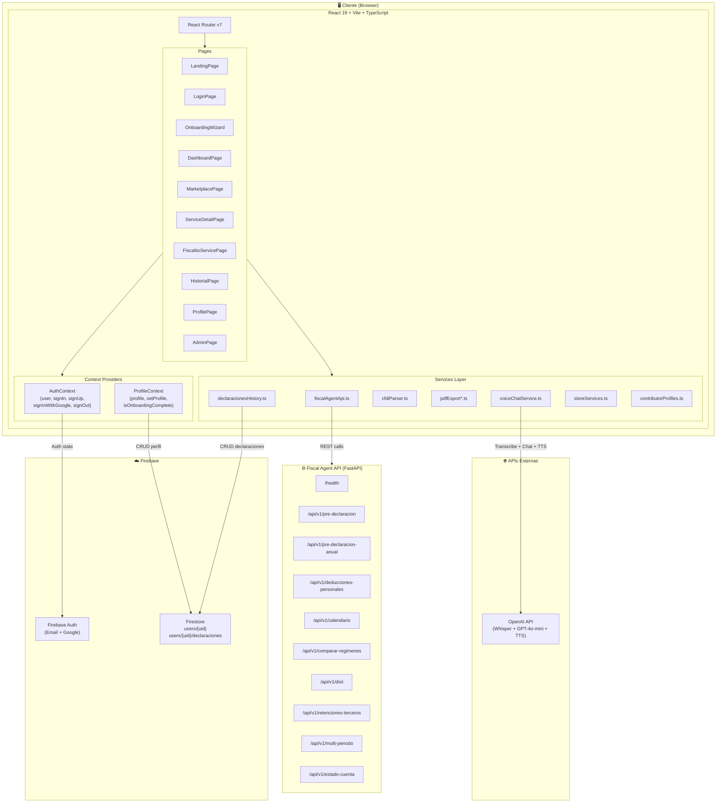
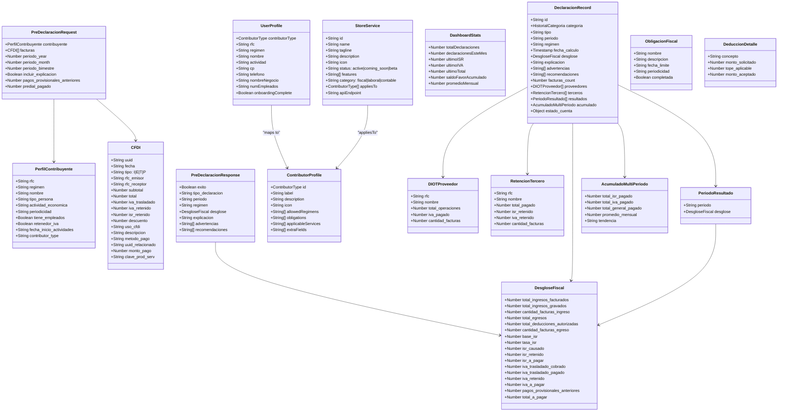
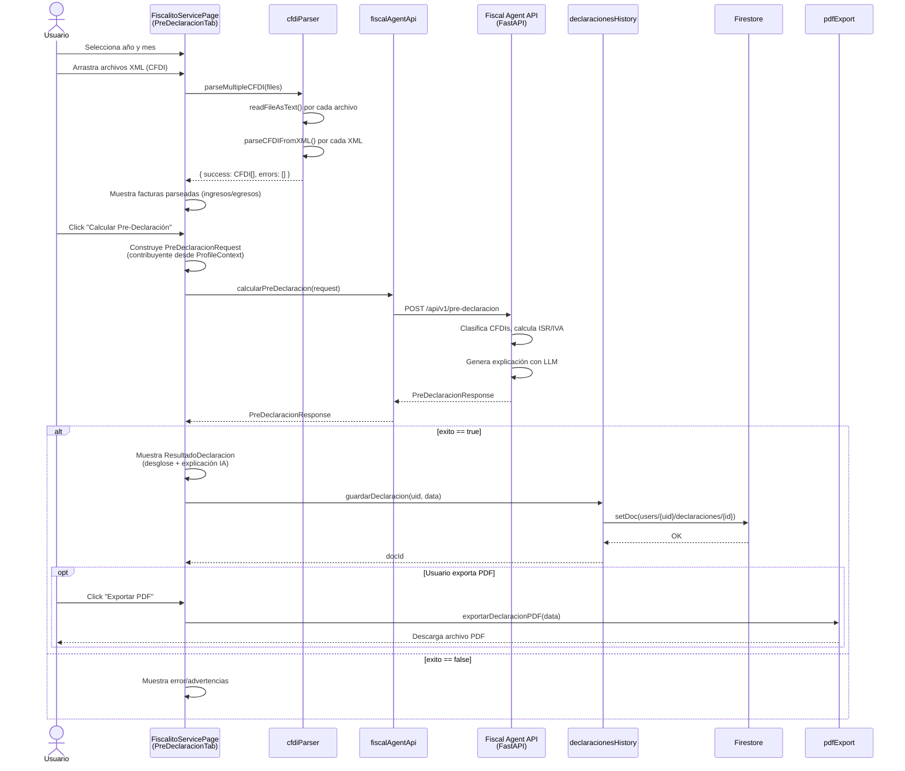
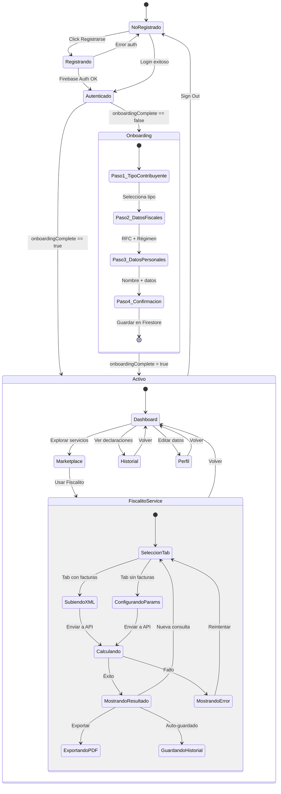
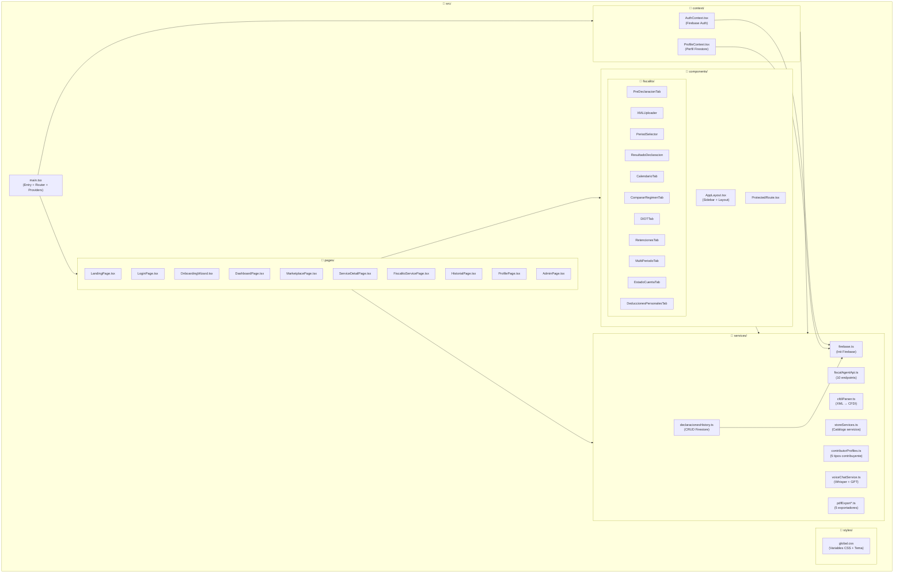
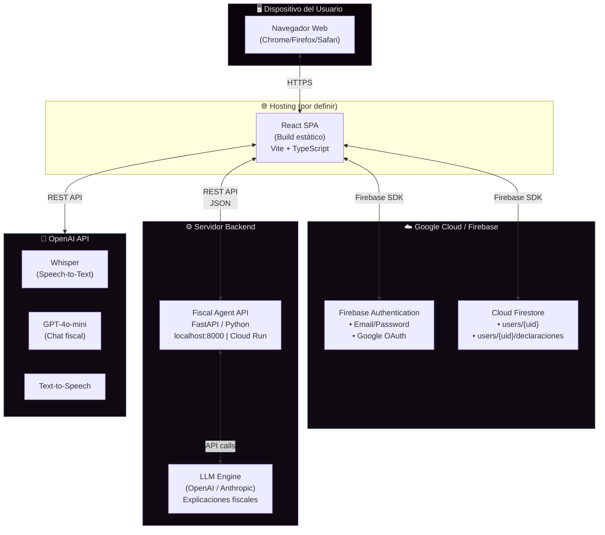
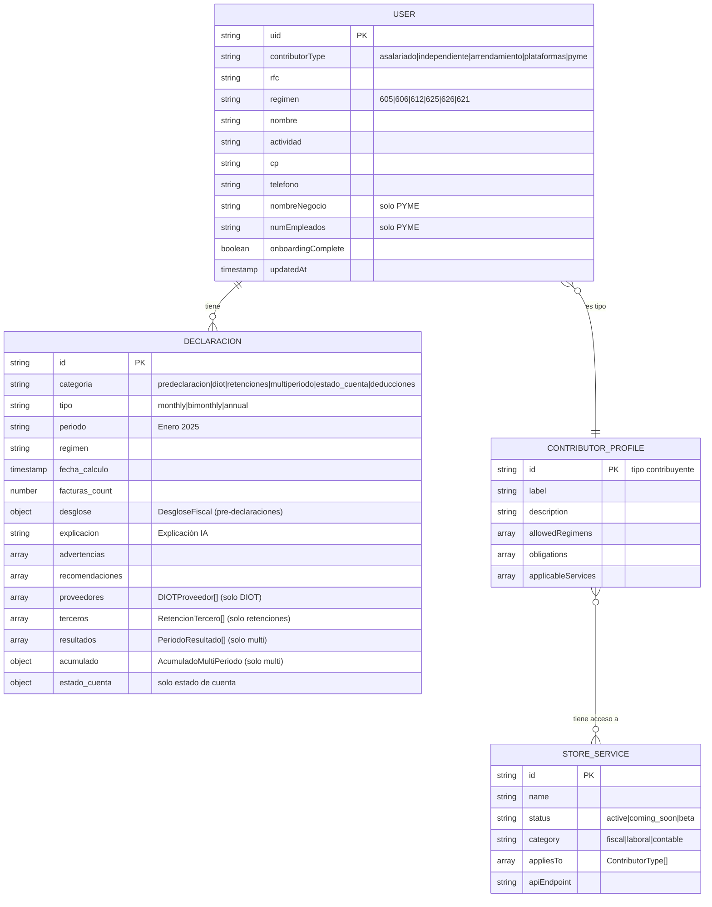

# Diagramas UML — Fiscalito Store

## 1. Diagrama de Componentes (Arquitectura General)

---

## 2. Diagrama de Clases (Modelos de Datos)

---

## 3. Diagrama de Secuencia — Flujo de Pre-Declaracion

---

## 4. Diagrama de Secuencia — Registro y Onboarding

```mermaid
sequenceDiagram
    actor U as Usuario
    participant LP as LoginPage
    participant AC as AuthContext
    participant FA as Firebase Auth
    participant OW as OnboardingWizard
    participant PC as ProfileContext
    participant FS as Firestore

    U->>LP: Ingresa email + password
    LP->>AC: signUp(email, password)
    AC->>FA: createUserWithEmailAndPassword()
    FA-->>AC: User credential
    AC-->>LP: user !== null

    LP->>LP: Redirige a /app
    Note over LP: ProtectedRoute detecta<br/>onboarding incompleto
    LP->>OW: Redirige a /app/onboarding

    rect rgb(30, 20, 40)
        Note over OW: Paso 1: Tipo de Contribuyente
        U->>OW: Selecciona tipo (ej: independiente)
    end

    rect rgb(30, 20, 40)
        Note over OW: Paso 2: Datos Fiscales
        U->>OW: Ingresa RFC + selecciona régimen
    end

    rect rgb(30, 20, 40)
        Note over OW: Paso 3: Datos Personales
        U->>OW: Nombre, teléfono, actividad, CP
    end

    rect rgb(30, 20, 40)
        Note over OW: Paso 4: Confirmación
        U->>OW: Click "Comenzar"
    end

    OW->>PC: setProfile({ ...allData, onboardingComplete: true })
    PC->>FS: setDoc(users/{uid}, profileData, merge)
    FS-->>PC: OK
    PC-->>OW: Perfil guardado

    OW->>OW: Redirige a /app (Dashboard)
```

---

## 5. Diagrama de Casos de Uso

```mermaid
graph TB
    subgraph Actores
        Asal["👤 Asalariado<br/>(Régimen 605)"]
        Indep["👤 Independiente<br/>(RESICO 626 / Emp. 612)"]
        Arrend["👤 Arrendamiento<br/>(Régimen 606)"]
        Plat["👤 Plataformas<br/>(Régimen 625)"]
        PYME["👤 PYME<br/>(612/626/621)"]
        Admin["🔧 Admin"]
    end

    subgraph Auth["Autenticación"]
        UC1["Registrarse<br/>(Email/Google)"]
        UC2["Iniciar Sesión"]
        UC3["Completar Onboarding<br/>(4 pasos)"]
    end

    subgraph Comunes["Casos de Uso Comunes"]
        UC4["Ver Dashboard<br/>con estadísticas"]
        UC5["Ver Marketplace<br/>de servicios"]
        UC6["Editar Perfil<br/>de contribuyente"]
        UC7["Ver Historial<br/>de declaraciones"]
        UC8["Exportar PDF"]
        UC9["Chat por Voz<br/>(Fiscalito AI)"]
    end

    subgraph FiscalitoUC["Fiscalito — Servicios Fiscales"]
        UC10["Calcular<br/>Pre-Declaración<br/>ISR/IVA"]
        UC11["Ver Calendario<br/>de Obligaciones"]
        UC12["Comparar Régimenes<br/>(RESICO vs Emp.)"]
        UC13["Generar DIOT<br/>(Proveedores)"]
        UC14["Calcular Retenciones<br/>a Terceros"]
        UC15["Análisis<br/>Multi-Periodo"]
        UC16["Estado de Cuenta<br/>y Proyección Anual"]
        UC17["Calcular Deducciones<br/>Personales"]
    end

    subgraph AdminUC["Administración"]
        UC18["Gestionar Servicios"]
        UC19["Gestionar Usuarios"]
    end

    %% Todos los usuarios
    Asal --> UC1 & UC2 & UC3
    Indep --> UC1 & UC2 & UC3
    Arrend --> UC1 & UC2 & UC3
    Plat --> UC1 & UC2 & UC3
    PYME --> UC1 & UC2 & UC3

    Asal --> UC4 & UC5 & UC6 & UC7 & UC8 & UC9
    Indep --> UC4 & UC5 & UC6 & UC7 & UC8 & UC9
    Arrend --> UC4 & UC5 & UC6 & UC7 & UC8 & UC9
    Plat --> UC4 & UC5 & UC6 & UC7 & UC8 & UC9
    PYME --> UC4 & UC5 & UC6 & UC7 & UC8 & UC9

    %% Asalariado: solo deducciones y calendario
    Asal --> UC17 & UC11

    %% Independiente: declaración, calendario, comparar, estado + según régimen
    Indep --> UC10 & UC11 & UC12 & UC16
    Indep -.->|"Solo Empresarial<br/>(612)"| UC13 & UC14 & UC15

    %% Arrendamiento
    Arrend --> UC10 & UC11 & UC12 & UC15 & UC16

    %% Plataformas
    Plat --> UC10 & UC11 & UC16

    %% PYME: todos los tabs
    PYME --> UC10 & UC11 & UC12 & UC13 & UC14 & UC15 & UC16 & UC17

    %% Admin
    Admin --> UC18 & UC19

    %% Dependencias
    UC10 -.->|"include"| UC8
    UC13 -.->|"include"| UC8
    UC14 -.->|"include"| UC8
    UC15 -.->|"include"| UC8
    UC16 -.->|"include"| UC8
```

---

## 6. Diagrama de Estados — Ciclo de Vida del Usuario

---

## 7. Diagrama de Paquetes (Estructura del Proyecto)

---

## 8. Diagrama de Despliegue

---

## 9. Diagrama Entidad-Relacion (Firestore)

---

## Notas

- Los diagramas reflejan el estado actual del proyecto al 7 de abril 2026.
- Para renderizar: GitHub, GitLab, Notion, VS Code (con extensión Mermaid), o [mermaid.live](https://mermaid.live).
- El Fiscal Agent API es stateless — toda la lógica de persistencia está en Firestore desde el frontend.
